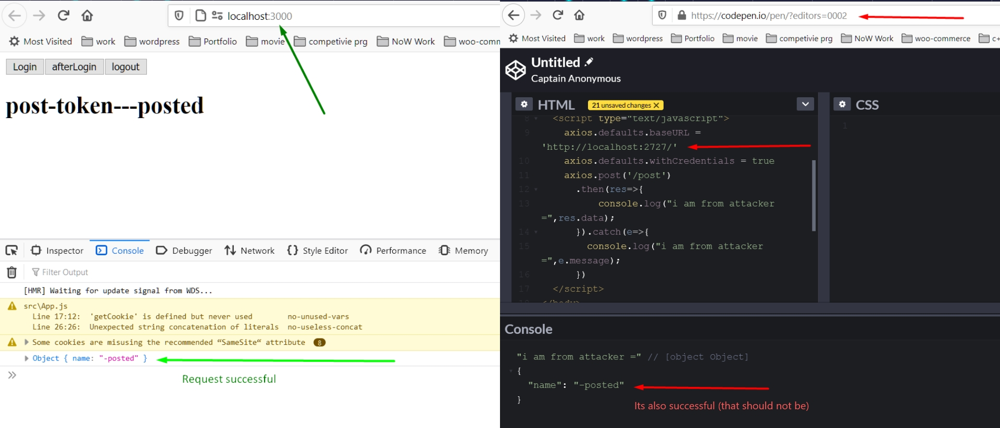

### With CSRF protection : 
>> here we can see after login if we try to do csrf attack then it failed.

### No CSRF protection : 
>> here we can see after login if we try to do csrf attack then it success.

>>more about csrf attck: 

<a href="http://expressjs.com/en/resources/middleware/csurf.html">CSURF Middleware</a>